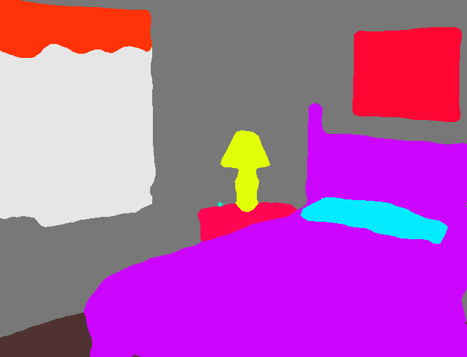

# GluonCV-Torch

Load [GluonCV](https://gluon-cv.mxnet.io/) Models in PyTorch.
Simply `import gluoncvth` to getting better pretrained model than `torchvision`:

```python
import gluoncvth as gcv
model = gcv.models.resnet50(pretrained=True)
```

**Installation**:

```bash
pip install gluoncv-torch
```


## Available Models

### ImageNet

ImageNet models single-crop error rates, comparing to the `torchvision` models:

|                                 | torchvision     |               | gluoncvth     |             |
|---------------------------------|-----------------|---------------|---------------|-------------|
| Model                           | Top-1 error     | Top-5 error   | Top-1 error   | Top-5 error |  
| [ResNet18](#resnet)             | 30.24           | 10.92         | 29.06         | 10.17       |
| [ResNet34](#resnet)             | 26.70           | 8.58          | 25.35         | 7.92        |
| [ResNet50](#resnet)             | 23.85           | 7.13          | 22.33         | 6.18        |
| [ResNet101](#resnet)            | 22.63           | 6.44          | 20.80         | 5.39        |
| [ResNet-152](#resnet)           | 21.69           | 5.94          | 20.56         | 5.39        |
| Inception v3                    | 22.55           | 6.44          | 21.33         | 5.61        |

More models available at [GluonCV Image Classification ModelZoo](https://gluon-cv.mxnet.io/model_zoo/classification.html#imagenet)

### Semantic Segmentation

Results on Pascal VOC dataset:

| Model                   | Base Network  | mIoU       |
|-------------------------|---------------|------------|
| [FCN](#fcn)             | ResNet101     | 83.6       |
| [PSPNet](#pspnet)       | ResNet101     | 85.1       |
| [DeepLabV3](#deeplabv3) | ResNet101     | 86.2       |

Results on ADE20K dataset:

| Model                   | Base Network  | PixAcc    | mIoU       |
|-------------------------|---------------|-----------|------------|
| [FCN](#fcn)             | ResNet101     | 80.6      | 41.6       |
| [PSPNet](#pspnet)       | ResNet101     | 80.8      | 42.9       |
| [DeepLabV3](#deeplabv3) | ResNet101     | 81.1      | 44.1       |

**Quick Demo the model**

```python
import torch
import gluoncvth

# Get the model
model = gluoncvth.models.get_deeplab_resnet101_ade(pretrained=True)
model.eval()

# Prepare the image
url = 'https://github.com/zhanghang1989/image-data/blob/master/encoding/' + \
    'segmentation/ade20k/ADE_val_00001142.jpg?raw=true'
filename = 'example.jpg'
img = gluoncvth.utils.load_image(
    gluoncvth.utils.download(url, filename)).unsqueeze(0)

# Make prediction
output = model.evaluate(img)
predict = torch.max(output, 1)[1].cpu().numpy() + 1

# Get color pallete for visualization
mask = gluoncvth.utils.get_mask_pallete(predict, 'ade20k')
mask.save('output.png')
```




More models available at [GluonCV Semantic Segmentation ModelZoo](https://gluon-cv.mxnet.io/model_zoo/segmentation.html)

## API Reference

### ResNet

- `gluoncvth.models.resnet18(pretrained=True)`
- `gluoncvth.models.resnet34(pretrained=True)`
- `gluoncvth.models.resnet50(pretrained=True)`
- `gluoncvth.models.resnet101(pretrained=True)`
- `gluoncvth.models.resnet152(pretrained=True)`

### FCN

- `gluoncvth.models.get_fcn_resnet101_voc(pretrained=True)`
- `gluoncvth.models.get_fcn_resnet101_ade(pretrained=True)`

### PSPNet

- `gluoncvth.models.get_psp_resnet101_voc(pretrained=True)`
- `gluoncvth.models.get_psp_resnet101_ade(pretrained=True)`

### DeepLabV3

- `gluoncvth.models.get_deeplab_resnet101_voc(pretrained=True)`
- `gluoncvth.models.get_deeplab_resnet101_ade(pretrained=True)`

### 

## Why [GluonCV](https://gluon-cv.mxnet.io/)?

**1. State-of-the-art Implementations**

**2. Pretrained Models and Tutorials**

**3. Community Support**

We expect this PyTorch inference API for GluonCV models will be beneficial to the entire computer vision comunity.
